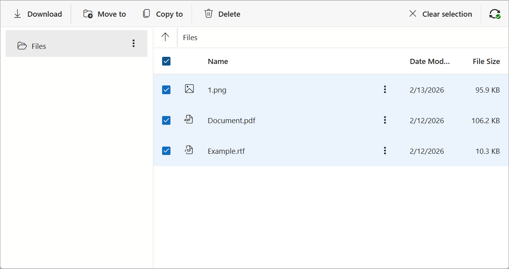

<!-- default badges list -->

[](https://supportcenter.devexpress.com/ticket/details/T1321985)
[](https://docs.devexpress.com/GeneralInformation/403183)
[](#does-this-example-address-your-development-requirementsobjectives)
<!-- default badges end -->
# Blazor - Use DevExtreme FileManager in Blazor Applications

This example adds a [DevExtreme FileManager UI component](https://js.devexpress.com/jQuery/Demos/WidgetsGallery/Demo/FileManager/Overview/FluentBlueLight/) to a Blazor application.



## Implementation Details

### Register DevExtreme Resources

DevExtreme widgets require the use of [DevExtreme scripts and stylesheets](https://js.devexpress.com/jQuery/Documentation/Guide/jQuery_Components/Add_DevExtreme_to_a_jQuery_Application/#Local_Files). We recommend that you use [npm](https://js.devexpress.com/jQuery/Documentation/Guide/Common/Distribution_Channels/#npm) to incorporate DevExtreme into the application.

The DevExpress Blazor [Resource Manager](https://docs.devexpress.com/Blazor/DevExpress.Blazor.DxResourceManager) automatically registers DevExtreme scripts if your project includes the `DevExpress.Blazor` package. To apply the DevExtreme Fluent theme, add the [dx.fluent.blue.light.css](./FileManagerBlazorApp/wwwroot/css/dx.fluent.blue.light.css) file to the [wwwroot/css](./FileManagerBlazorApp/wwwroot/css/) folder and reference this stylesheet in the [Components/App.razor](/FileManagerBlazorApp/Components/App.razor#L10) file.

### Create an Endpoint to Access a File System

To allow the DevExtreme FileManager to access and modify a file system, create a separate endpoint - define and configure a controller action as the [Remote File System Provider](https://docs.devexpress.com/AspNetCore/401320/devextreme-based-controls/controls/file-manager#remote-file-system-provider) help topic describes. This example uses the following approach ([FileManagerApiController.cs](/FileManagerBlazorApp/Controllers/FileManagerApiController.cs)):

```cs
[AutoValidateAntiforgeryToken]
[Route("api/file-manager-file-system")]
public object FileSystem(FileSystemCommand command, string arguments) {
    var config = new FileSystemConfiguration {
        Request = Request,
        FileSystemProvider = new PhysicalFileSystemProvider(Path.Combine(_hostingEnvironment.ContentRootPath, "Documents")),
        AllowDownload = true,
        AllowCreate = true,
        AllowCopy = true,
        AllowMove = true,
        AllowDelete = true,
        AllowRename = true,
        AllowUpload = true
    };
    var processor = new FileSystemCommandProcessor(config);
    var result = processor.Execute(command, arguments);
    return result.GetClientCommandResult();
}
```

### Implement a Wrapper

Implement a Blazor component that wraps a DevExtreme FileManager UI component. The wrapper consists of the following files (copy them to your solution):

* [DevExtremeFileManager.razor.js](/FileManagerBlazorApp/DevExtremeComponents/DevExtremeFileManager.razor.js) defines an `initializeFileManager` JavaScript function that creates and returns a DevExtreme FileManager instance using `element` and `endPointUrl` parameters:
    ```js
    export async function initializeFileManager(element, apiUrl) {

        const provider = new DevExpress.fileManagement.RemoteFileSystemProvider({
            endpointUrl: apiUrl,
            beforeAjaxSend: function ({ headers, formData, xhrFields }) {
                headers.RequestVerificationToken = document.getElementsByName("__RequestVerificationToken")[0].value;
            },
            beforeSubmit: function ({ formData }) {
                formData["__RequestVerificationToken"] = document.getElementsByName("__RequestVerificationToken")[0].value;
            }
        });

        return new DevExpress.ui.dxFileManager(element, {
            fileSystemProvider: provider,
            permissions: {
                download: true,
                create: true,
                copy: true,
                move: true,
                delete: true,
                rename: true,
                upload: true
            }
        });
    }
    ```
* [DevExtremeFileManager.razor](/FileManagerBlazorApp/DevExtremeComponents/DevExtremeFileManager.razor) loads all client scripts on the first render via the [LoadDxResources](https://docs.devexpress.com/Blazor/DevExpress.Blazor.DxResourceManager.LoadDxResources(Microsoft.JSInterop.IJSRuntime)) method call and executes the `initializeFileManager` function:
    ```Razor
    protected override async Task OnAfterRenderAsync(bool firstRender) {
        if (firstRender) {
            await JS.LoadDxResources();
            ClientModule = await JS.InvokeAsync<IJSObjectReference>("import", "./DevExtremeComponents/DevExtremeFileManager.razor.js");
            ClientFileManager = await ClientModule.InvokeAsync<IJSObjectReference>("initializeFileManager", FileManagerRef,
                NavManager.ToAbsoluteUri("api/file-manager-file-system"));
        }

        await base.OnAfterRenderAsync(firstRender);
    }
    ```

### Display a Blazor Component

Use the wrapper as a standard Blazor component:

```Razor
<DevExtremeFileManager></DevExtremeFileManager>
```

## Files to Review

- [FileManagerApiController.cs](/FileManagerBlazorApp/Controllers/FileManagerApiController.cs)
- [DevExtremeFileManager.razor](/FileManagerBlazorApp/DevExtremeComponents/DevExtremeFileManager.razor)
- [DevExtremeFileManager.razor.js](/FileManagerBlazorApp/DevExtremeComponents/DevExtremeFileManager.razor.js)
- [Components/App.razor](/FileManagerBlazorApp/Components/App.razor)
- [Index.razor](/FileManagerBlazorApp/Components/Pages/Index.razor)

## Documentation

- [Add DevExtreme Components to a Blazor Application](https://docs.devexpress.com/Blazor/403578/components/devextreme-components-in-blazor)
- [Get Started with DevExtreme jQuery/JS](https://js.devexpress.com/jQuery/Documentation/Guide/Common/First_Steps/)
- [JavaScript/jQuery FileManager - Getting Started](https://js.devexpress.com/jQuery/Documentation/Guide/UI_Components/FileManager/Getting_Started_with_File_Manager/)
- [Remote File System Provider](https://docs.devexpress.com/AspNetCore/401320/devextreme-based-controls/controls/file-manager#remote-file-system-provider)

## More Examples

- [Blazor - Use DevExtreme Circular Gauge in a Blazor Application](https://github.com/DevExpress-Examples/blazor-use-devextreme-circular-gauge)
- [Blazor - Use DevExtreme Diagram in Blazor Applications](https://github.com/DevExpress-Examples/blazor-use-devextreme-diagram)
- [Blazor - Use DevExtreme Slider in Blazor Applications](https://github.com/DevExpress-Examples/blazor-use-devextreme-slider)

<!-- feedback -->
## Does This Example Address Your Development Requirements/Objectives?

[](https://www.devexpress.com/support/examples/survey.xml?utm_source=github&utm_campaign=draft-use-devextreme-filemanager-in-blazor&~~~was_helpful=yes) [](https://www.devexpress.com/support/examples/survey.xml?utm_source=github&utm_campaign=draft-use-devextreme-filemanager-in-blazor&~~~was_helpful=no)

(you will be redirected to DevExpress.com to submit your response)
<!-- feedback end -->
